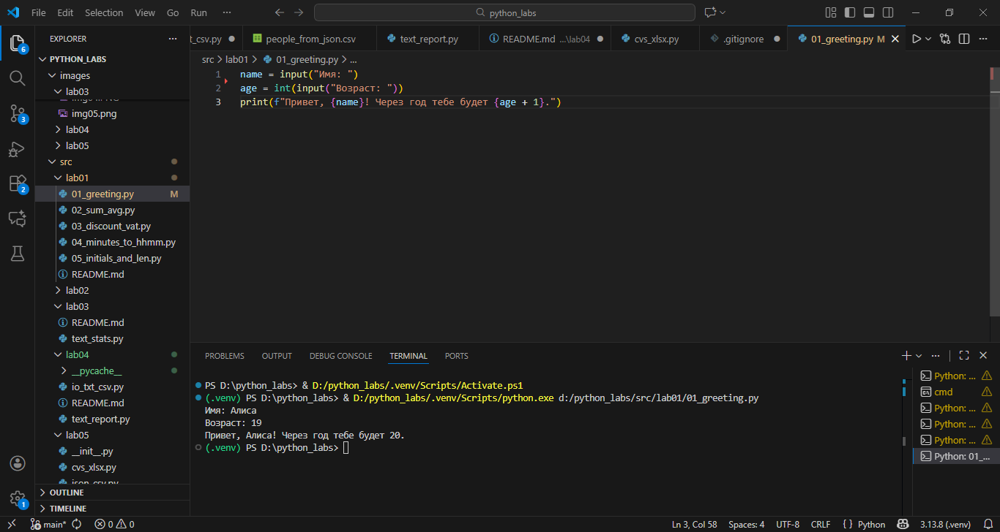
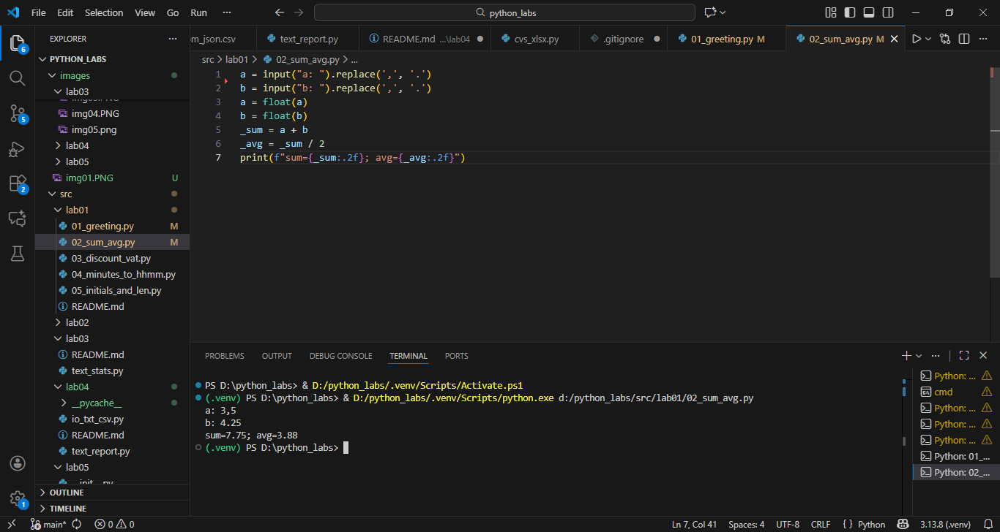
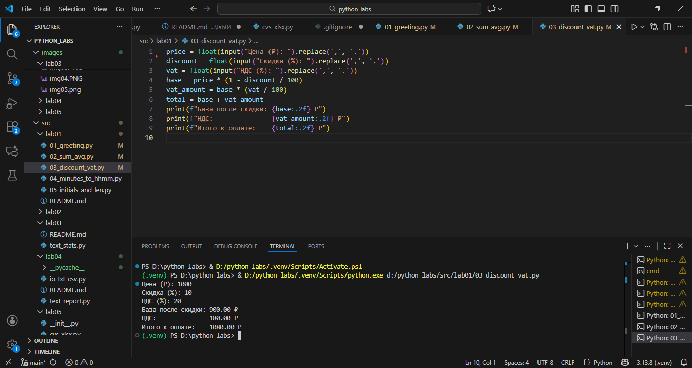
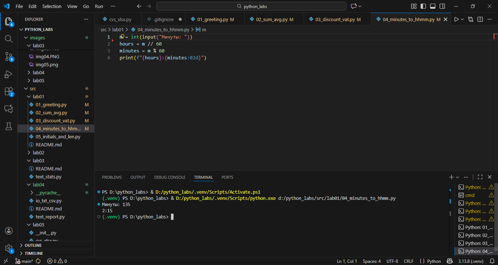
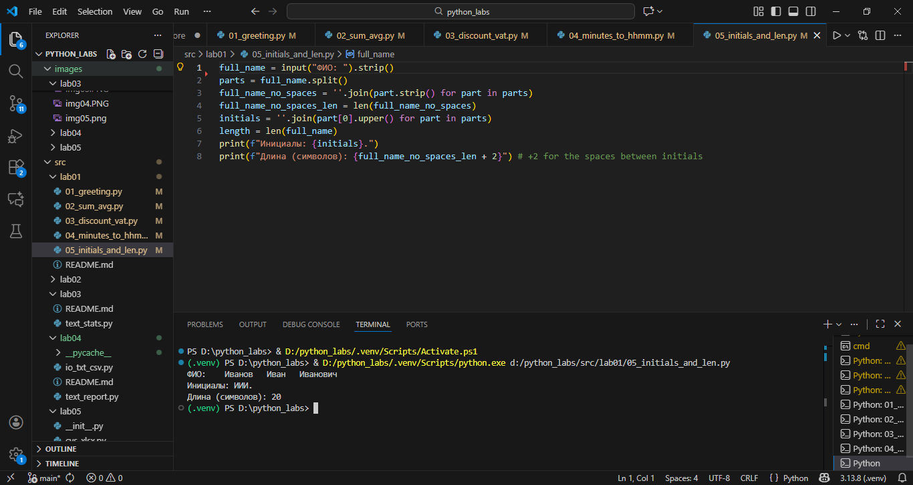

# ЛР1 — Ввод/вывод и форматирование
## Задание 1 — Привет и возраст

```
Файл: src/01_greeting.py
Ввод: имя (строка), возраст (целое).
Вывод: Привет, <имя>! Через год тебе будет <возраст+1>.

Пример:

Имя: Алиса
Возраст: 19
Привет, Алиса! Через год тебе будет 20.
G)
```


## Задание 2 — Сумма и среднее
```
Файл: src/02_sum_avg.py
Ввод: два числа (вещественные), допускаются точка или запятая.
Вывод: sum=<...>; avg=<...> — значения печатать с 2 знаками.

Пример:

a: 3,5
b: 4.25
sum=7.75; avg=3.88
```


## Задание 3 — Чек: скидка и НДС
```
Файл: src/03_discount_vat.py
Ввод: price (₽), discount (%), vat (%) — вещественные.
Формулы:
base = price * (1 - discount/100)
vat_amount = base * (vat/100)
total = base + vat_amount
Вывод: по строкам, 2 знака после запятой.

База после скидки: 900.00 ₽
НДС:               180.00 ₽
Итого к оплате:    1080.00 ₽

(пример входных: price=1000, discount=10, vat=20)
```


## Задание 4 — Минуты → ЧЧ:ММ
```
Файл: src/04_minutes_to_hhmm.py
Ввод: m — целые минуты.
Вывод: ЧЧ:ММ минуты вывести как {min:02d}.

Пример:

Минуты: 135
2:15
```


## Задание 5 — Инициалы и длина строки
```
Файл: src/05_initials_and_len.py
Ввод: ФИО одной строкой (могут быть лишние пробелы).
Вывод: инициалы (верхний регистр) и длина исходной строки без лишних пробелов.

Пример:

ФИО:   Иванов   Иван   Иванович  
Инициалы: ИИИ.
Длина (символов): 20
```
