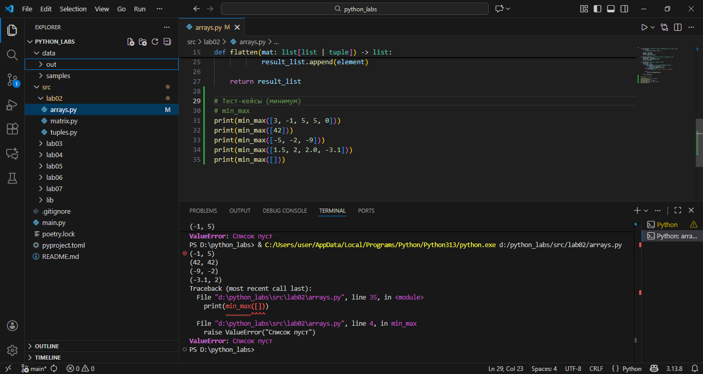
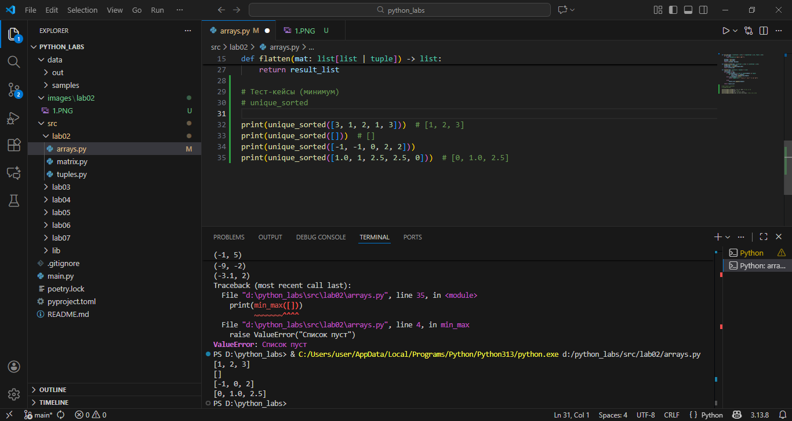
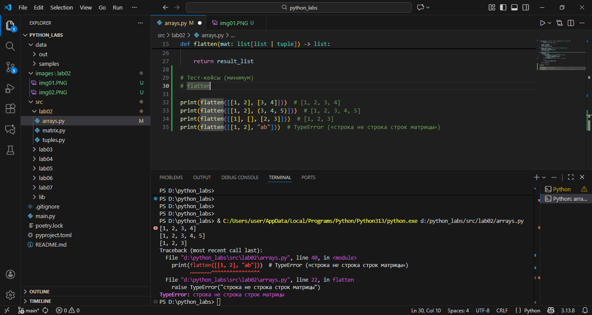
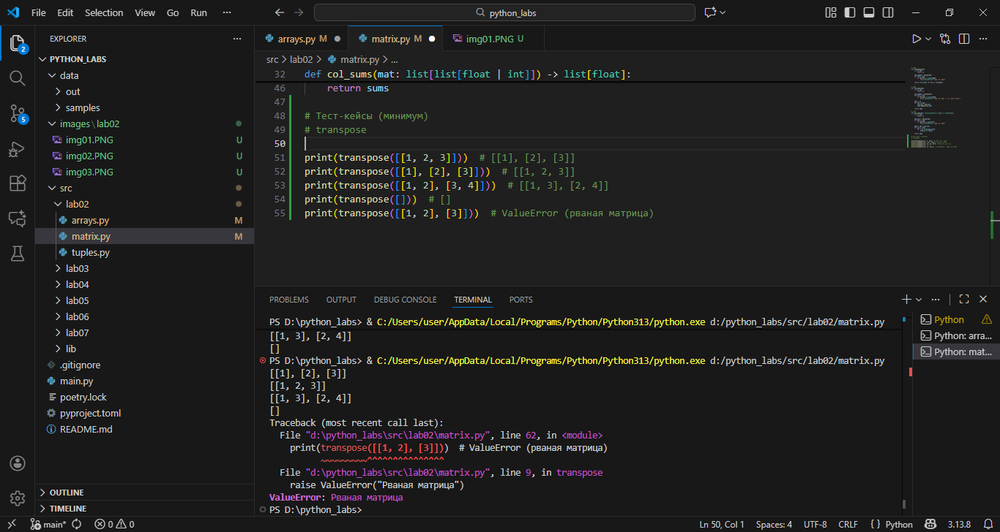
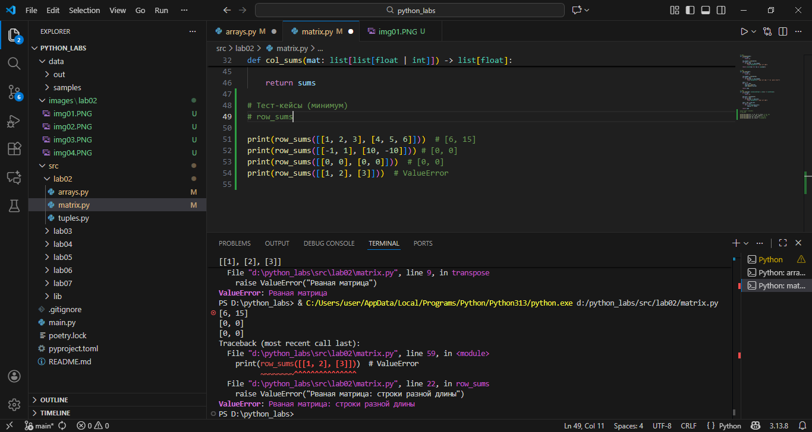
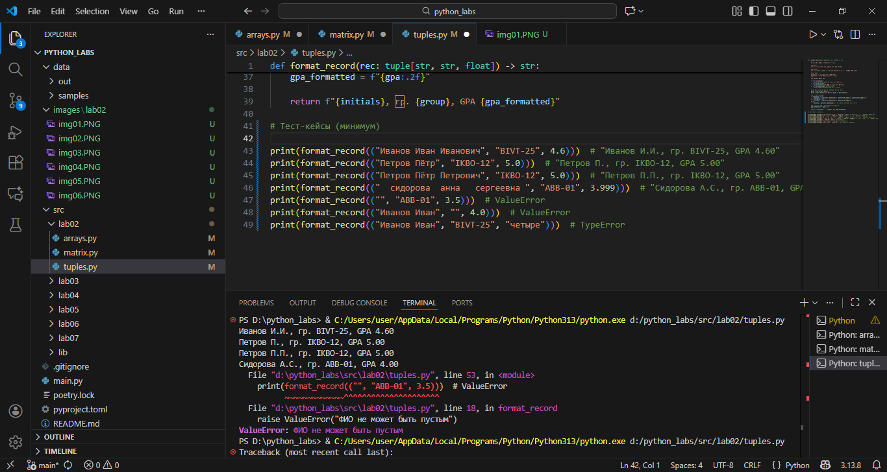
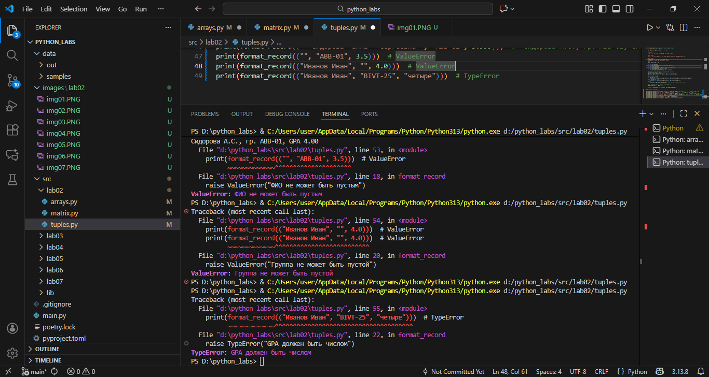

# ЛР2 — Коллекции и матрицы (list/tuple/set/dict)

## Задание 1 — arrays.py
```
Реализуйте функции:

    min_max(nums: list[float | int]) -> tuple[float | int, float | int]
    Вернуть кортеж (минимум, максимум). Если список пуст — ValueError.

    unique_sorted(nums: list[float | int]) -> list[float | int]
    Вернуть отсортированный список уникальных значений (по возрастанию).

    flatten(mat: list[list | tuple]) -> list
    «Расплющить» список списков/кортежей в один список по строкам (row-major). Если встретилась строка/элемент, который не является списком/кортежем — TypeError.

Тест-кейсы (минимум)

min_max

    [3, -1, 5, 5, 0] → (-1, 5)
    [42] → (42, 42)
    [-5, -2, -9] → (-9, -2)
    [] → ValueError
    [1.5, 2, 2.0, -3.1] → (-3.1, 2)

unique_sorted

    [3, 1, 2, 1, 3] → [1, 2, 3]
    [] → []
    [-1, -1, 0, 2, 2] → [-1, 0, 2]
    [1.0, 1, 2.5, 2.5, 0] → [0, 1.0, 2.5] (допускаем смешение int/float)

flatten

    [[1, 2], [3, 4]] → [1, 2, 3, 4]
    [[1, 2], (3, 4, 5)] → [1, 2, 3, 4, 5]
    [[1], [], [2, 3]] → [1, 2, 3]
    [[1, 2], "ab"] → TypeError («строка не строка строк матрицы»)

```




## Задание B — matrix.py
```
Реализуйте функции (для прямоугольных матриц — одинаковая длина строк):

    transpose(mat: list[list[float | int]]) -> list[list]
    Поменять строки и столбцы местами. Пустая матрица [] → [].
    Если матрица «рваная» (строки разной длины) — ValueError.

    row_sums(mat: list[list[float | int]]) -> list[float]
    Сумма по каждой строке. Требуется прямоугольность (см. выше).

    col_sums(mat: list[list[float | int]]) -> list[float]
    Сумма по каждому столбцу. Требуется прямоугольность.

Тест-кейсы (минимум)

transpose

    [[1, 2, 3]] → [[1], [2], [3]]
    [[1], [2], [3]] → [[1, 2, 3]]
    [[1, 2], [3, 4]] → [[1, 3], [2, 4]]
    [] → []
    [[1, 2], [3]] → ValueError (рваная матрица)

row_sums

    [[1, 2, 3], [4, 5, 6]] → [6, 15]
    [[-1, 1], [10, -10]] → [0, 0]
    [[0, 0], [0, 0]] → [0, 0]
    [[1, 2], [3]] → ValueError (рваная)

col_sums

    [[1, 2, 3], [4, 5, 6]] → [5, 7, 9]
    [[-1, 1], [10, -10]] → [9, -9]
    [[0, 0], [0, 0]] → [0, 0]
    [[1, 2], [3]] → ValueError (рваная)
```




## Задание C — tuples.py
```
Работаем с «записями» как с кортежами.

    Определите тип записи студента как кортеж:
    (fio: str, group: str, gpa: float)

    Реализуйте format_record(rec: tuple[str, str, float]) -> str
    Вернуть строку вида:
    Иванов И.И., гр. BIVT-25, GPA 4.60
    Правила:
        ФИО может быть «Фамилия Имя Отчество» или «Фамилия Имя» — инициалы формируются из 1–2 имён (в верхнем регистре).
        Лишние пробелы нужно убрать (strip, «схлопнуть» внутри).
        GPA печатается с 2 знаками (округление правилами Python).

Тест-кейсы (минимум)

    ("Иванов Иван Иванович", "BIVT-25", 4.6) → "Иванов И.И., гр. BIVT-25, GPA 4.60"
    ("Петров Пётр", "IKBO-12", 5.0) → "Петров П., гр. IKBO-12, GPA 5.00"
    ("Петров Пётр Петрович", "IKBO-12", 5.0) → "Петров П.П., гр. IKBO-12, GPA 5.00"
    ("  сидорова  анна   сергеевна ", "ABB-01", 3.999) → "Сидорова А.С., гр. ABB-01, GPA 4.00"
    Некорректные записи (пустое ФИО, пустая группа, неверный тип GPA) → ValueError/TypeError по усмотрению (описать в докстринге).
```

