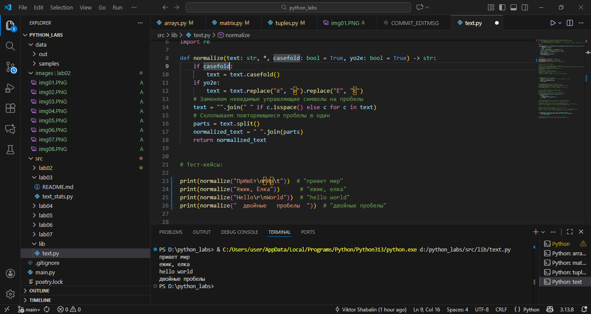
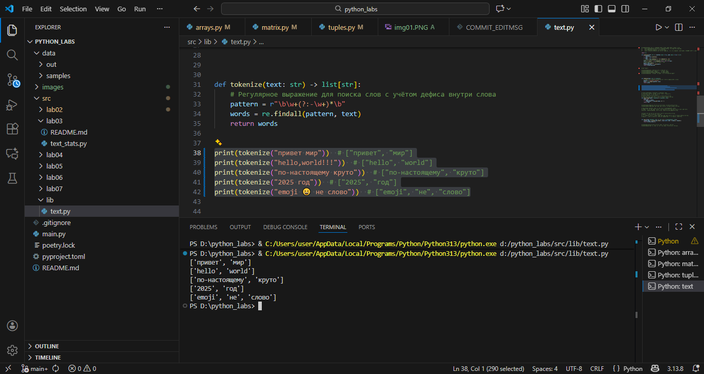
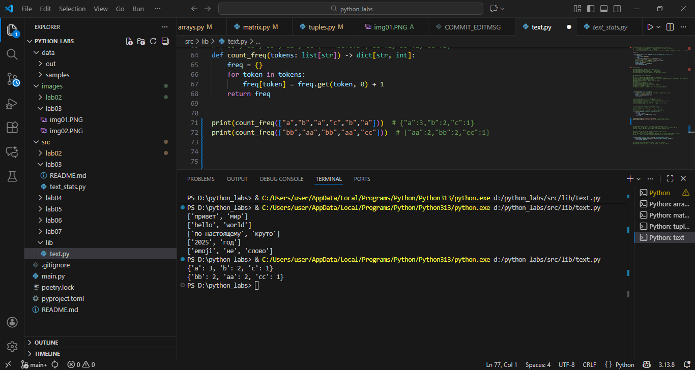
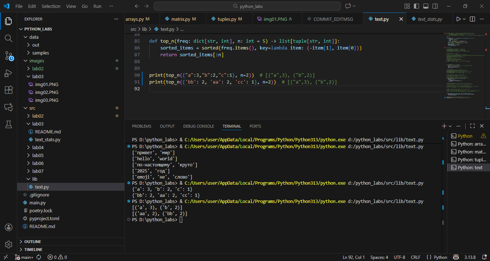

# ЛР3 — Тексты и частоты слов (словарь/множество)

## Задание A — src/lib/text.py
```
Реализуйте функции:

    normalize(text: str, *, casefold: bool = True, yo2e: bool = True) -> str
        Если casefold=True — привести к casefold (лучше, чем lower для Юникода).
        Если yo2e=True — заменить все ё/Ё на е/Е.
        Убрать невидимые управляющие символы (например, \t, \r) → заменить на пробелы, схлопнуть повторяющиеся пробелы в один.

    tokenize(text: str) -> list[str]
        Разбить на «слова» по небуквенно-цифровым разделителям.
        В качестве слова считаем последовательности символов \w (буквы/цифры/подчёркивание) плюс дефис внутри слова (например, по-настоящему).
        Числа (например, 2025) считаем словами.

    count_freq(tokens: list[str]) -> dict[str, int]
        Подсчитать частоты, вернуть словарь слово → количество.

    top_n(freq: dict[str, int], n: int = 5) -> list[tuple[str, int]]
        Вернуть топ-N по убыванию частоты; при равенстве — по алфавиту слова.

Тест-кейсы

normalize

    "ПрИвЕт\nМИр\t" → "привет мир" (casefold + схлопнуть пробелы)
    "ёжик, Ёлка" (yo2e=True) → "ежик, елка"
    "Hello\r\nWorld" → "hello world"
    "  двойные   пробелы  " → "двойные пробелы"

tokenize (предполагаем, что текст уже normalize)

    "привет мир" → ["привет", "мир"]
    "hello,world!!!" → ["hello", "world"]
    "по-настоящему круто" → ["по-настоящему", "круто"]
    "2025 год" → ["2025", "год"]
    "emoji 😀 не слово" → ["emoji", "не", "слово"] (эмодзи выпадают)

count_freq + top_n

    Токены ["a","b","a","c","b","a"] → частоты {"a":3,"b":2,"c":1};
    top_n(..., n=2) → [("a",3), ("b",2)]
    При равенстве частот: токены ["bb","aa","bb","aa","cc"] → частоты {"aa":2,"bb":2,"cc":1};
    top_n(..., n=2) → [("aa",2), ("bb",2)] (алфавитная сортировка при равенстве).
```





## Задание B — src/text_stats.py (скрипт со stdin)
```
Скрипт читает одну строку текста из stdin (или весь ввод до EOF — на ваш выбор, опишите в README), вызывает функции из lib/text.py и печатает:

    Всего слов: <N>
    Уникальных слов: <K>
    Топ-5: — по строке на запись в формате слово:кол-во (по убыванию, как в top_n).

Пример запуска

В терминале:

$ echo "Привет, мир! Привет!!!" | python src/text_stats.py
Всего слов: 3
Уникальных слов: 2
Топ-5:
привет:2
мир:1
```


## ★ Дополнительно (со звёздочкой)
```
Табличный вывод для задания Б (красиво выровненная таблица)

Формат:

слово        | частота
----------------------
привет       | 10
мир          | 7
...

    Ширина столбца «слово» — по максимальной длине слова из топа.
    Добавьте флаг окружения (или константу в коде), чтобы включать/выключать табличный режим.
```
