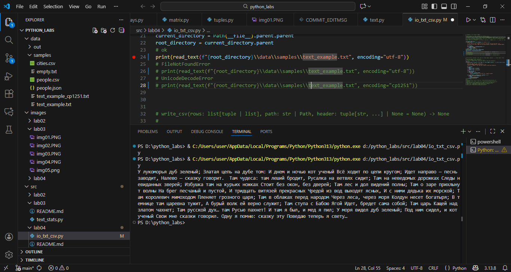
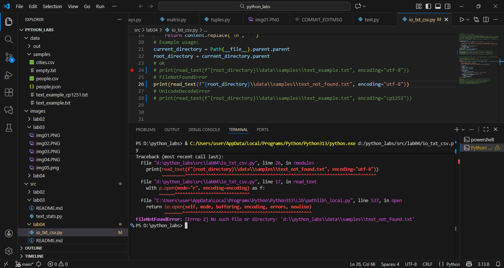
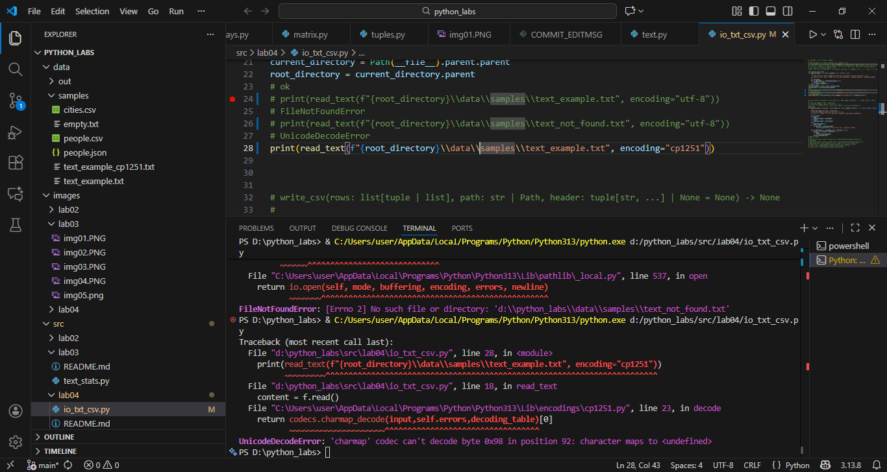
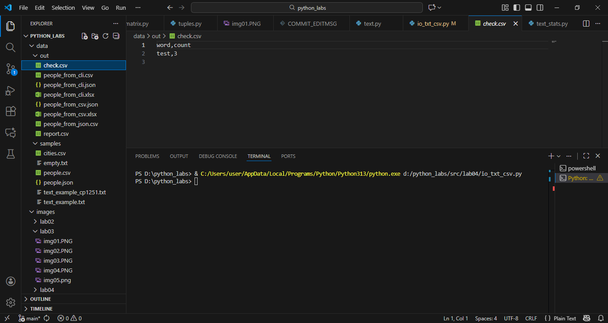
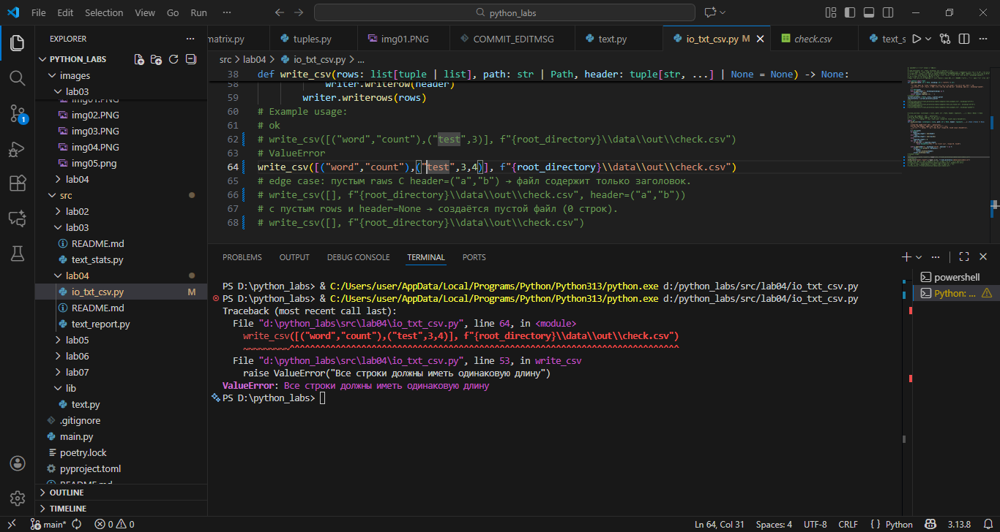
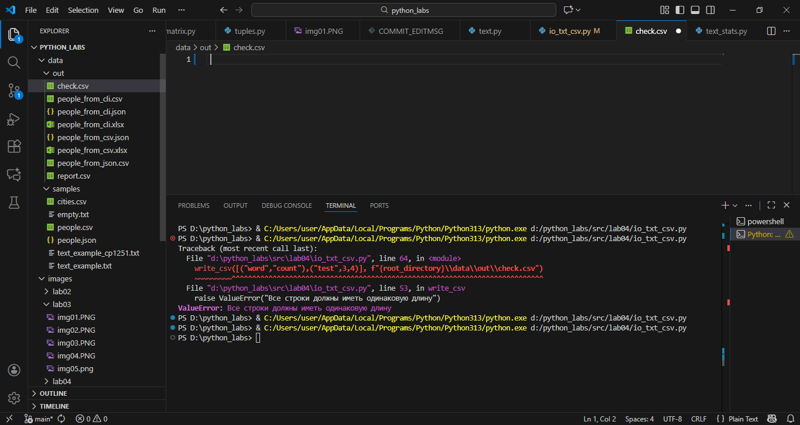
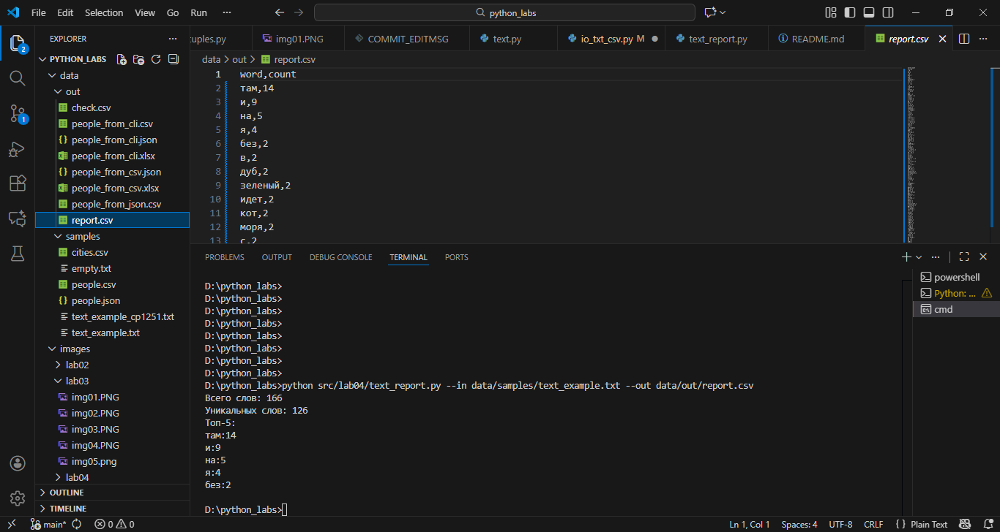

# ЛР4 — Файлы: TXT/CSV и отчёты по текстовой статистике

# Задание A — модуль src/lab04/io_txt_csv.py
```
Реализуйте (с докстрингами и типами):

    read_text(path: str | Path, encoding: str = "utf-8") -> str
        Открыть файл на чтение в указанной кодировке и вернуть содержимое как одну строку.
        Обрабатывать ошибки: если файл не найден — поднимать FileNotFoundError (пусть падает), если кодировка не подходит — поднимать UnicodeDecodeError (пусть падает).
        НО: в докстринге опишите, как пользователь может выбрать другую кодировку (пример: encoding="cp1251").

    write_csv(rows: list[tuple | list], path: str | Path, header: tuple[str, ...] | None = None) -> None
        Создать/перезаписать CSV с разделителем ,.
        Если передан header, записать его первой строкой.
        Проверить, что каждая строка в rows имеет одинаковую длину (иначе ValueError).

★ (опционально, но полезно) ensure_parent_dir(path: str | Path) -> None

    Создать родительские директории, если их нет (для удобства перед записью).

Мини‑тесты (ручные, для README)

from src.io_txt_csv import read_text, write_csv
txt = read_text("data/input.txt")  # должен вернуть строку
write_csv([("word","count"),("test",3)], "data/check.csv")  # создаст CSV

Краевые случаи

    Пустой файл → возвращается пустая строка.
    Файл очень большой → допускается читать целиком (наше ТЗ), но в README отметить, что в реале стоит читать построчно.
    write_csv с пустым rows и header=None → создаётся пустой файл (0 строк). С header=("a","b") → файл содержит только заголовок.

```








## Задание B — скрипт src/lab04/text_report.py
```
Напишите скрипт, который:

    Читает один входной файл data/input.txt (путь можно захардкодить или принять параметром командной строки — опишите в README).
    Нормализует текст (lib/text.py), токенизирует и считает частоты слов.
    Сохраняет data/report.csv c колонками: word,count, отсортированными: count ↓, слово ↑ (при равенстве).
    В консоль печатает краткое резюме:
        Всего слов: <N>
        Уникальных слов: <K>
        Топ-5: (список из top_n из ЛР3)

Пример запуска

python src/lab04/text_report.py                 # читает data/input.txt, пишет data/report.csv
python src/lab04/text_report.py --in data/in.txt --out data/out.csv

Пример report.csv

word,count
привет,2
мир,1

Краевые случаи

    data/input.txt не существует → понятная ошибка в консоли (исключение пусть всплывает или выведите print() и sys.exit(1) — опишите поведение в README).
    Пустой вход → report.csv будет содержать только заголовок или будет пустым (примите решение и опишите — рекомендую только заголовок).
    Нестандартная кодировка → укажите, как передать --encoding cp1251 (если реализуете argparse).
```



