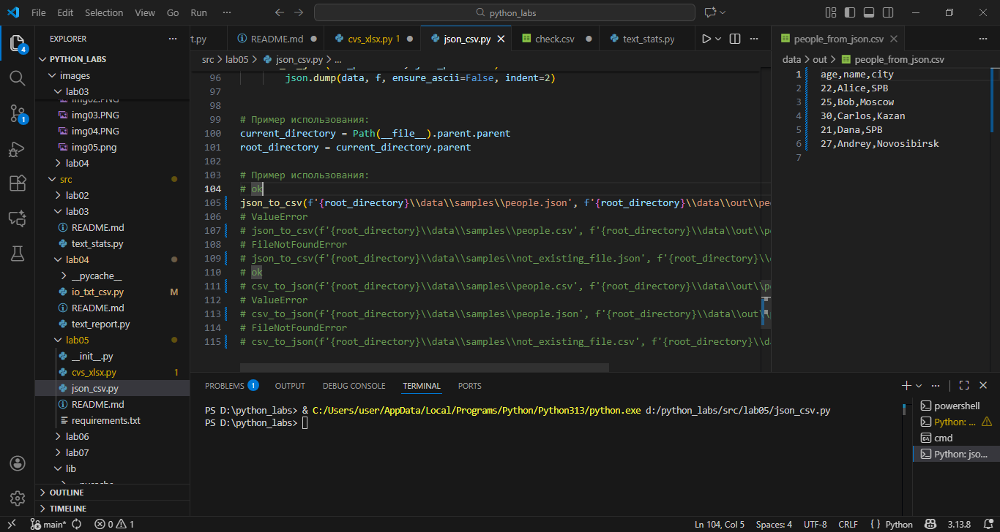
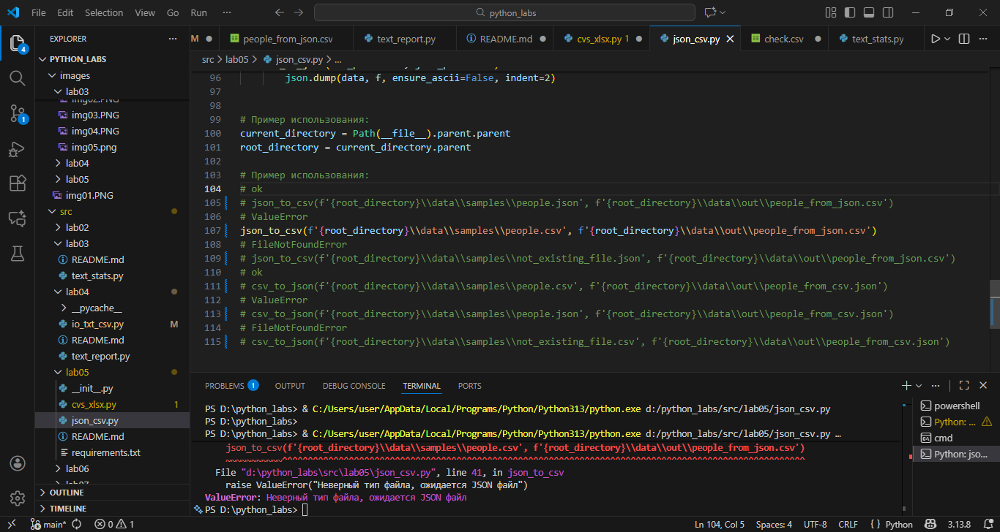
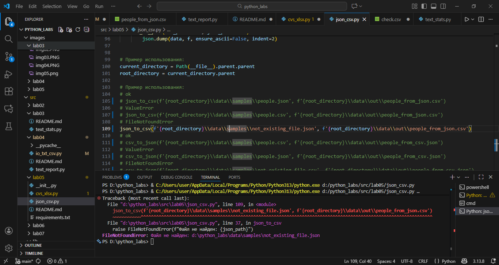
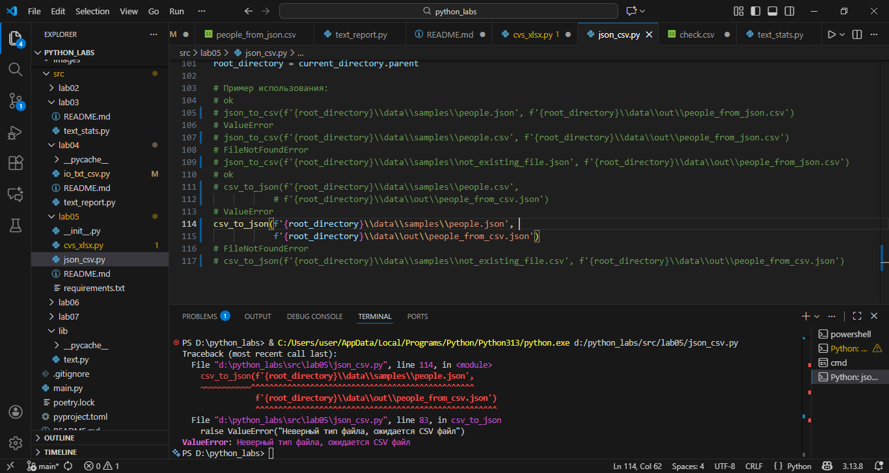
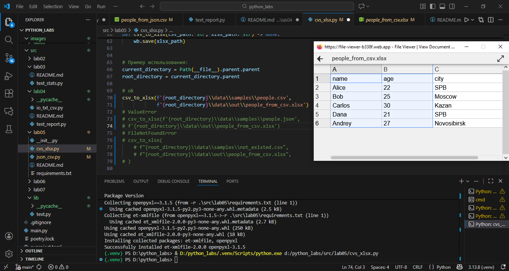
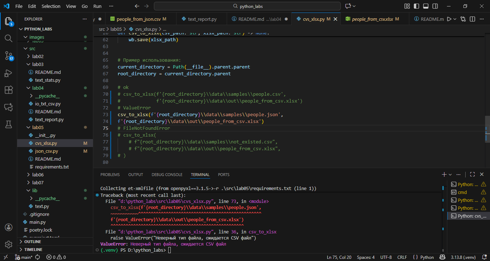
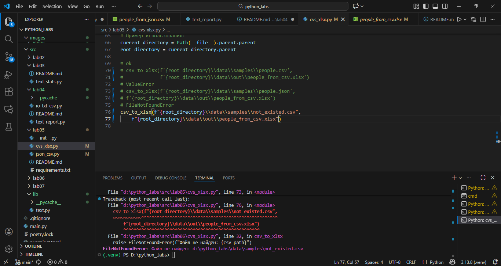

# ЛР5 — JSON и конвертации (JSON↔CSV, CSV→XLSX)
## Задание A — JSON ↔ CSV
```
Реализовать модуль src/lab05/json_csv.py с функциями:

def json_to_csv(json_path: str, csv_path: str) -> None:
    """
    Преобразует JSON-файл в CSV.
    Поддерживает список словарей [{...}, {...}], заполняет отсутствующие поля пустыми строками.
    Кодировка UTF-8. Порядок колонок — как в первом объекте или алфавитный (указать в README).
    """
def csv_to_json(csv_path: str, json_path: str) -> None:
    """
    Преобразует CSV в JSON (список словарей).
    Заголовок обязателен, значения сохраняются как строки.
    json.dump(..., ensure_ascii=False, indent=2)
    """

Требования:

    Проверка ошибок:
        неверный тип файла, пустой JSON или CSV → ValueError.
        осутствующий файл → FileNotFoundError
    Не использовать внешние пакеты (только json, csv, pathlib).
    Все пути относительные.
    Кодировка — строго UTF-8.
```






## Задание B — CSV → XLSX
```
Реализовать модуль src/lab05/csv_xlsx.py:

def csv_to_xlsx(csv_path: str, xlsx_path: str) -> None:
    """
    Конвертирует CSV в XLSX.
    Использовать openpyxl ИЛИ xlsxwriter.
    Первая строка CSV — заголовок.
    Лист называется "Sheet1".
    Колонки — автоширина по длине текста (не менее 8 символов).
    """

Требования:

    Проверка ошибок:
        неверный тип файла, пустой JSON или CSV → ValueError.
        осутствующий файл → FileNotFoundError
    Не использовать внешние пакеты.
    Все пути относительные.
    Кодировка — строго UTF-8.
    Результат — открываемый XLSX с корректной структурой таблицы.
```


