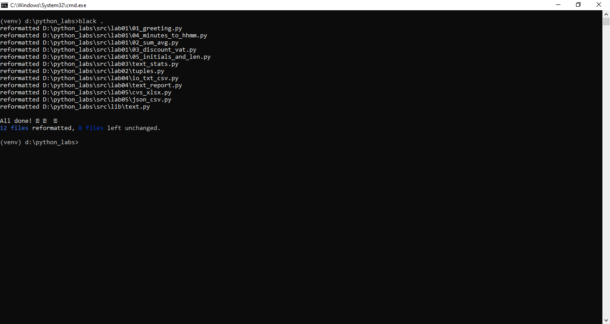
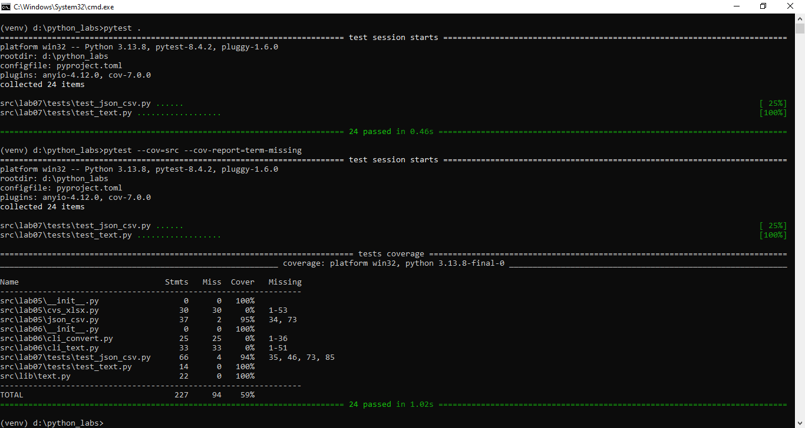

# ЛР7 — Тестирование: pytest + стиль (black)

## A. Тесты для src/lib/text.py
```
Написать автотесты для всех публичных функций модуля:

    normalize(text: str) -> str
    tokenize(text: str) -> list[str]
    count_freq(tokens: list[str]) -> dict[str, int]
    top_n(freq: dict[str, int], n: int) -> list[tuple[str, int]]

Требования:

    покрыть как минимум:
        базовые случаи (обычный текст),
        граничные случаи (пустые строки, повторы, спецсимволы),
        сценарий с одинаковой частотой слов (проверка сортировки по алфавиту при равных значениях);
    использовать pytest, допускается параметризация (@pytest.mark.parametrize). Что это такое?

B. Тесты для src/lab05/json_csv.py

Написать автотесты для функций:

    json_to_csv(src_path: str, dst_path: str)
    csv_to_json(src_path: str, dst_path: str)

Позитивные сценарии:

    корректная конвертация JSON → CSV и CSV → JSON;
    совпадает количество записей;
    совпадает набор ключей/заголовков (например, name, age).

Негативные сценарии (минимум):

    пустой или некорректный входной файл → ожидаем ValueError;
    несуществующий путь к файлу → ожидаем FileNotFoundError.
```


## C. Стиль кода (black)
```
перед сдачей ЛР:

    отформатировать проект:

        black .

для самопроверки:

    black --check .
```


## ★ Дополнительное задание: покрытие кода
```
установить плагин pytest-cov;
запустить тесты с покрытием:

    pytest --cov=src --cov-report=term-missing

проанализировать, какие строки/функции не покрыты тестами.
```

```
Тестами не покрыты следующие строки кода:

src/lab05/cvs_xlsx.py                 30     30     0%   15-74
src/lab05/json_csv.py                 37      2    95%   53, 92
src/lab06/__init__.py                  0      0   100%
src/lab06/cli_convert.py              25     25     0%   1-36
src/lab06/cli_text.py                 33     33     0%   1-51
src/lab07/tests/test_json_csv.py      66      4    94%   35, 46, 73, 85
```