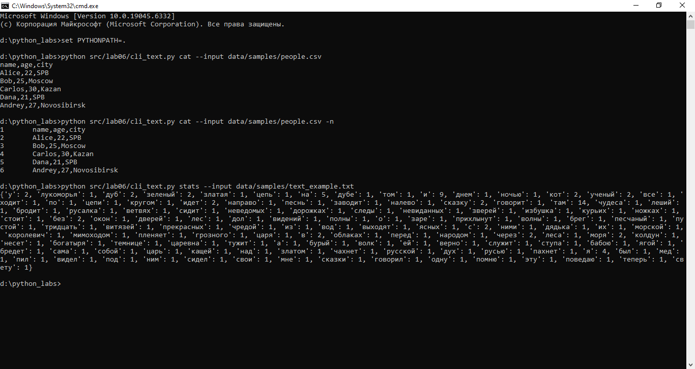
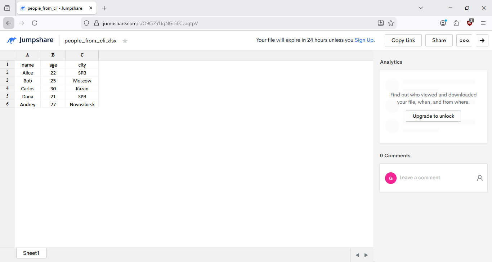

# ЛР6 — CLI‑утилиты с argparse (cat/grep‑lite + конвертеры)

## cli_text
```
Модуль src/lab06/cli_text.py с подкомандами:

    stats --input <txt> [--top 5] — анализ частот слов в тексте (использовать функции из lab03);
    cat --input <path> [-n] — вывод содержимого файла построчно (с нумерацией при -n).
```


## cli_convert
```
Модуль src/lab06/cli_convert.py с подкомандами:

    json2csv --in data/samples/people.json --out data/out/people.csv
    csv2json --in data/samples/people.csv --out data/out/people.json
    csv2xlsx --in data/samples/people.csv --out data/out/people.xlsx
    (использовать функции из lab05)
```


