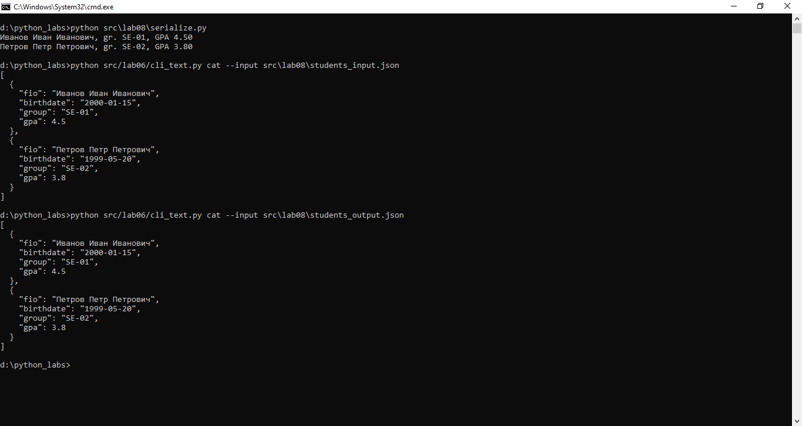

# ЛР8 – ООП в Python: @dataclass Student, методы и сериализация

## Примеры запуска функций
```
python src\lab08\serialize.py
```


## примеры JSON до/после преобразования


## описание структуры класса Student и логики его методов

### Структура класса

Класс `Student` представляет модель студента и содержит следующие элементы:

### Поля:
- **fio**: `str` — ФИО студента.
- **birthdate**: `str` — Дата рождения в формате `YYYY-MM-DD`.
- **group**: `str` — Группа, к которой относится студент.
- **gpa**: `float` — Средний балл (по умолчанию `0.0`).

### Методы:
1. **`__post_init__`**:
   - Выполняет валидацию:
     - Формата даты рождения (`YYYY-MM-DD`).
     - Диапазона среднего балла (`0 ≤ gpa ≤ 5`).
   - Выбрасывает исключение `ValueError` при нарушении условий.

2. **`age()`**:
   - Возвращает возраст студента в годах, рассчитанный на основе текущей даты и даты рождения.

3. **`to_dict()`**:
   - Преобразует объект `Student` в словарь с ключами:
     - `fio`
     - `birthdate`
     - `group`
     - `gpa`

4. **`from_dict(data: Dict[str, any])`**:
   - Класс-метод, создающий объект `Student` из словаря.

5. **`__str__()`**:
   - Возвращает строковое представление объекта в формате:
     ```
     ФИО, gr. ГРУППА, GPA X.XX
     ```

## Логика работы методов

- **Валидация**:
  - Поле `birthdate` проверяется на соответствие формату `YYYY-MM-DD` с использованием регулярного выражения и функции `datetime.strptime`.
  - Поле `gpa` проверяется на соответствие диапазону от `0` до `5`.

- **Расчет возраста**:
  - Метод `age()` вычисляет разницу между текущей датой и датой рождения, учитывая месяц и день.

- **Сериализация и десериализация**:
  - Метод `to_dict()` преобразует объект в словарь для удобства хранения или передачи данных.
  - Метод `from_dict()` позволяет восстановить объект из словаря.

- **Строковое представление**:
  - Метод `__str__()` предоставляет удобный формат для вывода информации о студенте.

## Примеры запуска функций
