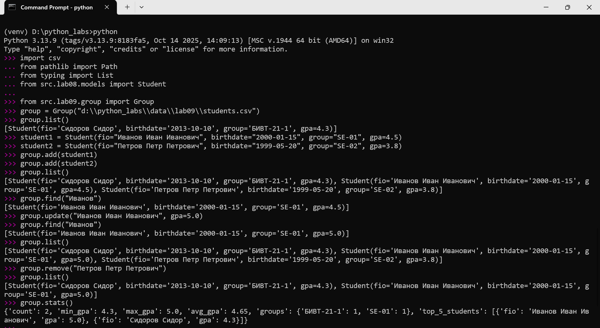

# ЛР9 — «База данных» на CSV: класс Group, CRUD-операции и CLI

## Задание
```
A. Реализовать класс Group, содержащий:

    поля (атрибуты экземпляра):
        path — путь к CSV-файлу с данными студентов

    методы:
        __init__(storage_path) — инициализация группы и файла-хранилища
        list() — вернуть всех студентов в виде списка Student
        add(student) — добавить нового студента в CSV
        find(substr) — найти студентов по подстроке в fio
        remove(fio) — удалить запись(и) с данным fio
        update(fio, **fields) — обновить поля существующего студента

    внутренние вспомогательные методы (опционально):
        _read_all() — прочитать все строки из CSV
        _ensure_storage_exists() — создать файл с заголовком, если его ещё нет

    валидация:
        наличие строки-заголовка в CSV (fio,birthdate,group,gpa)
        соответствие каждой строки корректному объекту Student

★ Дополнительное задание (со звёздочкой)
Расширенная аналитика по группе

Добавить в класс Group аналитический метод, собирающий статистику по студентам.
Метод stats(self) -> dict

Метод должен возвращать словарь следующей структуры:

{
    "count": <общее количество студентов>,
    "min_gpa": <минимальный gpa>,
    "max_gpa": <максимальный gpa>,
    "avg_gpa": <средний gpa>,
    "groups": {
        "БИВТ-21-1": <число студентов>,
        "БИВТ-21-2": <число студентов>,
        ...
    },
    "top_5_students": [
        {"fio": "...", "gpa": ...},
        ...
    ]
}
```
