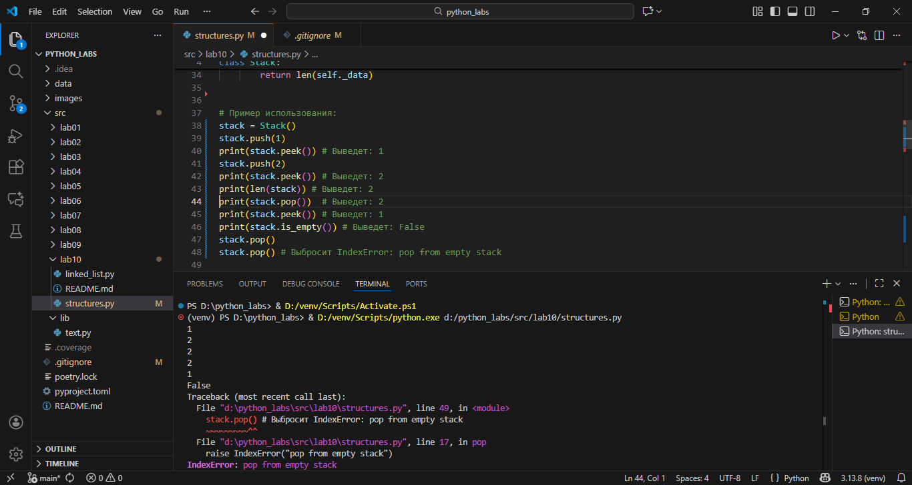
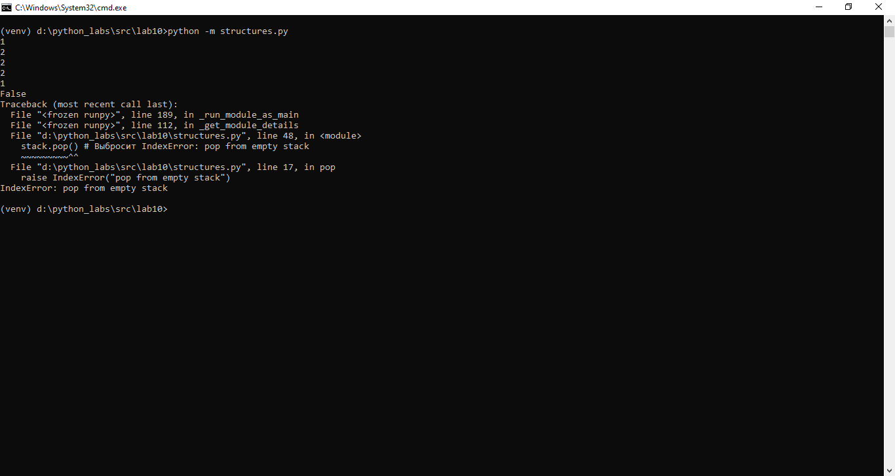
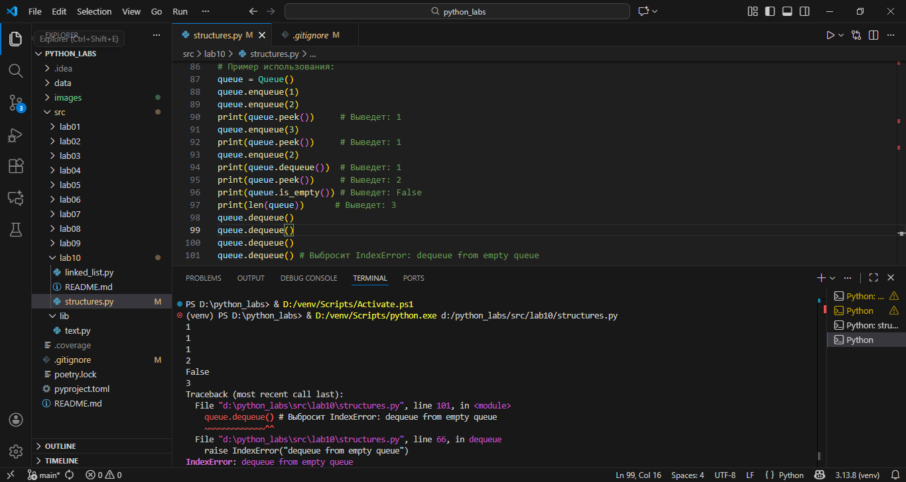
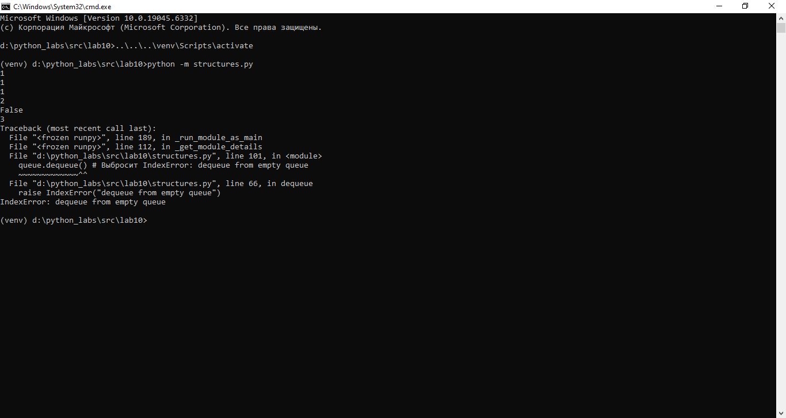
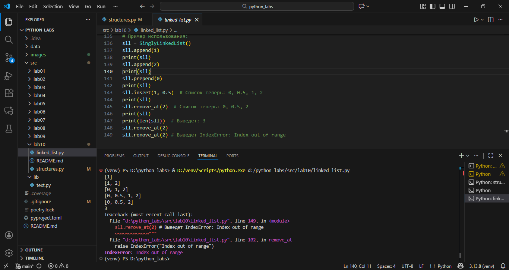
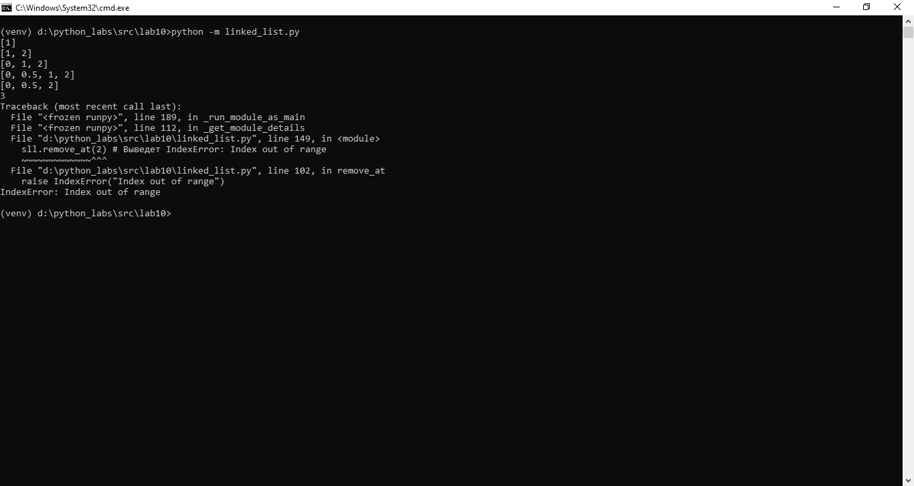
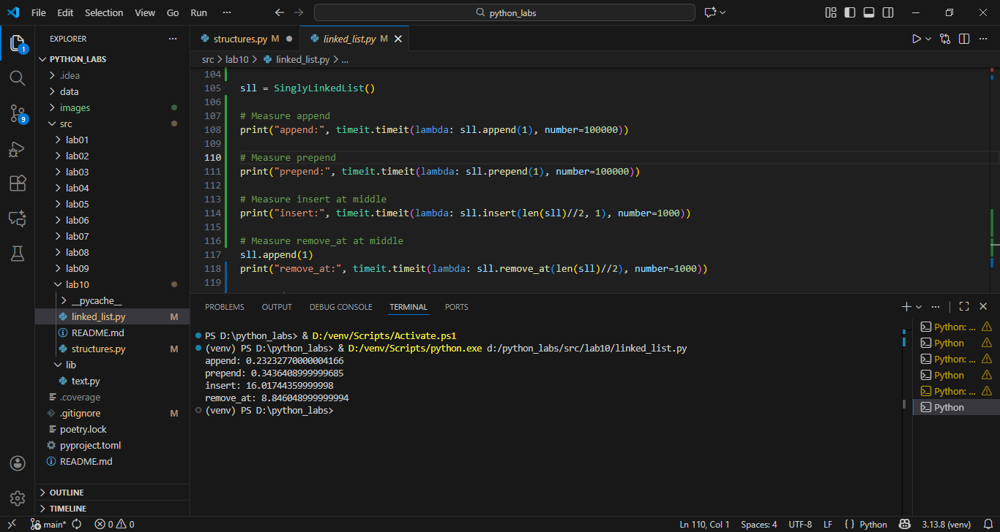
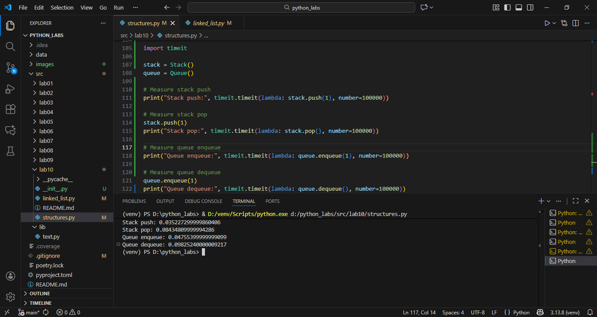

# ЛР10 — Структуры данных: Stack, Queue, Linked List и бенчмарки

## Теория
### Стек (Stack)

    Принцип: LIFO — Last In, First Out.

    Операции:
        push(x) — положить элемент сверху;
        pop() — снять верхний элемент;
        peek() — посмотреть верхний, не снимая.

    Типичные применения:
        история действий (undo/redo);
        обход графа/дерева в глубину (DFS);
        парсинг выражений, проверка скобок.

    Асимптотика (при реализации на массиве / списке):
        push — O(1) амортизированно;
        pop — O(1);
        peek — O(1);
        проверка пустоты — O(1).

    Сложность:
        Сложность структуры стека (stack) заключается в её ограниченном наборе операций 
        и принципе работы. Пользователь или программист может добавлять и удалять элементы 
        только с одного конца структуры — верхушки стека. Доступ к элементам, находящимся ниже 
        верхнего элемента, невозможен без предварительного удаления всех элементов, находящихся 
        выше них.
### Реализация:
```
class Stack:
    def __init__(self) -> None:
        self._data: list[Any] = []

    def push(self, item: Any) -> None:
        """Добавить элемент на вершину стека."""
        self._data.append(item)

    def pop(self) -> Any:
        """Снять верхний элемент стека и вернуть его.
        Если стек пуст — выбросить понятное исключение (например, IndexError с вменяемым сообщением).
        """
        if self.is_empty():
            raise IndexError("pop from empty stack")
        return self._data.pop()

    def peek(self) -> Any | None:
        """Вернуть верхний элемент без удаления.
        Если стек пуст — вернуть None.
        """
        if self.is_empty():
            return None
        return self._data[-1]

    def is_empty(self) -> bool:
        """Вернуть True, если стек пуст, иначе False."""
        return len(self._data) == 0

    def __len__(self) -> int:
        """Количество элементов в стеке."""
        return len(self._data)
```
Пример использования:



### Очередь (Queue)

    Принцип: FIFO — First In, First Out.

    Операции:
        enqueue(x) — добавить в конец;
        dequeue() — взять элемент из начала;
        peek() — посмотреть первый элемент, не удаляя.

    Типичные применения:
        обработка задач по очереди (job queue);
        обход графа/дерева в ширину (BFS);
        буферы (сетевые, файловые, очереди сообщений).

    В Python:
        обычный list плохо подходит для реализации очереди:
            удаление с начала pop(0) — это O(n) (все элементы сдвигаются);
        collections.deque даёт O(1) операции по краям:
            append / appendleft — O(1);
            pop / popleft — O(1).

    Асимптотика (на нормальной очереди):
        enqueue — O(1);
        dequeue — O(1);
        peek — O(1).

    Сложность:
        Сложность структуры очередь (queue) заключается в её ограниченном наборе операций 
        и принципе работы. Пользователь или программист может добавлять элементы только в конец очереди 
        и извлекать только из начала. Доступ к элементам, находящимся в середине очереди, невозможен 
        без предварительного удаления всех элементов, находящихся перед ними

### Реализация:
```
from collections import deque
class Queue:
    def __init__(self) -> None:
        self._data: deque[Any] = deque()

    def enqueue(self, item: Any) -> None:
        """Добавить элемент в конец очереди."""
        self._data.append(item)

    def dequeue(self) -> Any:
        """Взять элемент из начала очереди и вернуть его.
        Если очередь пустая — выбросить понятное исключение (например, IndexError).
        """
        if self.is_empty():
            raise IndexError("dequeue from empty queue")
        return self._data.popleft()

    def peek(self) -> Any | None:
        """Вернуть первый элемент без удаления.
        Если очередь пустая — вернуть None.
        """
        if self.is_empty():
            return None
        return self._data[0]

    def is_empty(self) -> bool:
        """Вернуть True, если очередь пуста."""
        return len(self._data) == 0

    def __len__(self) -> int:
        """Количество элементов в очереди."""
        return len(self._data)
```
Пример использования:



### Односвязный список (Singly Linked List)

    Структура:
        состоит из узлов Node;
        каждый узел хранит:
            value — значение элемента;
            next — ссылку на следующий узел или None (если это последний).

    Основные идеи:
        элементы не хранятся подряд в памяти, как в массиве;
        каждый элемент знает только «следующего соседа».

    Плюсы:
        вставка/удаление в начало списка за O(1):
            если есть ссылка на голову (head), достаточно перенаправить одну ссылку;
        при удалении из середины не нужно сдвигать остальные элементы:
            достаточно обновить ссылки узлов;
        удобно использовать как базовый строительный блок для других структур (например, для очередей, стеков, хеш-таблиц с цепочками).

    Сложность и минусы:
        доступ по индексу i — O(n):
            чтобы добраться до позиции i, нужно пройти i шагов от головы;
        нет быстрого доступа к предыдущему элементу:
            чтобы удалить узел, нужно знать его предыдущий узел → часто нужен дополнительный проход.

    Типичные операции и их асимптотика:
        prepend (добавить в начало) — O(1);
        append:
            при наличии tail — O(1),
            без tail — O(n), т.к. требуется пройти до конца;
        поиск по значению — O(n).

### Реализация:
```
from typing import Any, Optional
class Node:
    def __init__(self, value: Any) -> None:
        self.value: Any = value
        self.next: Optional[Node] = None


class SinglyLinkedList:
    def __init__(self) -> None:
        self.head: Optional[Node] = None
        self.tail: Optional[Node] = None
        self._size: int = 0

    def append(self, value: Any) -> None:
        """Добавить элемент в конец списка."""
        new_node = Node(value)
        if self.tail:
            self.tail.next = new_node
        else:
            self.head = new_node
        self.tail = new_node
        self._size += 1

    def prepend(self, value: Any) -> None:
        """Добавить элемент в начало списка."""
        new_node = Node(value)
        new_node.next = self.head
        self.head = new_node
        if self._size == 0:
            self.tail = new_node
        self._size += 1

    def insert(self, idx: int, value: Any) -> None:
        """Вставить элемент по индексу idx."""
        if idx < 0 or idx > self._size:
            raise IndexError("Index out of range")
        if idx == 0:
            self.prepend(value)
            return
        if idx == self._size:
            self.append(value)
            return
        new_node = Node(value)
        current = self.head
        for _ in range(idx - 1):
            current = current.next  # type: ignore
        new_node.next = current.next  # type: ignore
        current.next = new_node  # type: ignore
        self._size += 1

    def remove_at(self, idx: int) -> None:
        """Удалить элемент по индексу idx."""
        if idx < 0 or idx >= self._size:
            raise IndexError("Index out of range")
        if idx == 0:
            if self.head:
                self.head = self.head.next
                if self._size == 1:
                    self.tail = None
            self._size -= 1
            return
        current = self.head
        for _ in range(idx - 1):
            current = current.next  # type: ignore
        if current.next:
            current.next = current.next.next
            if idx == self._size - 1:
                self.tail = current
        self._size -= 1

    def __iter__(self):
        """Возвращает итератор по значениям в списке."""
        current = self.head
        while current:
            yield current.value
            current = current.next

    def __len__(self) -> int:
        """Возвращает количество элементов в списке."""
        return self._size

    def __repr__(self) -> str:
        """Возвращает строковое представление списка."""
        return str(list(self))
```
Пример использования:



## Производительность и бенчмарки:

Для оценки производительности различных структур данных и операций над ними можно использовать модуль timeit в Python. 
Он позволяет измерить время выполнения небольших фрагментов кода.
Пример бенчмарка для сравнения операций добавления и удаления элементов в список, стек и очередь.
### Бенчмарк для стека и очереди:
```
import timeit

stack = Stack()
queue = Queue()

# Measure stack push
print("Stack push:", timeit.timeit(lambda: stack.push(1), number=100000))

# Measure stack pop
stack.push(1)
print("Stack pop:", timeit.timeit(lambda: stack.pop(), number=100000))

# Measure queue enqueue
print("Queue enqueue:", timeit.timeit(lambda: queue.enqueue(1), number=100000))

# Measure queue dequeue
queue.enqueue(1)
print("Queue dequeue:", timeit.timeit(lambda: queue.dequeue(), number=100000))
```


### Бенчмарк для односвязного списка:
```
sll = SinglyLinkedList()

# Measure append
print("append:", timeit.timeit(lambda: sll.append(1), number=100000))

# Measure prepend
print("prepend:", timeit.timeit(lambda: sll.prepend(1), number=100000))

# Measure insert at middle
print("insert:", timeit.timeit(lambda: sll.insert(len(sll)//2, 1), number=1000))

# Measure remove_at at middle
sll.append(1)
print("remove_at:", timeit.timeit(lambda: sll.remove_at(len(sll)//2), number=1000))
```


## Выводы:
    Стек и очередь обеспечивают эффективные операции добавления и удаления элементов с концов.
    Односвязный список позволяет эффективно вставлять и удалять элементы в начале и конце, 
    но операции доступа по индексу требуют больше времени времени.
    Выбор структуры данных должен основываться на конкретных требованиях к операциям и их частоте использования.